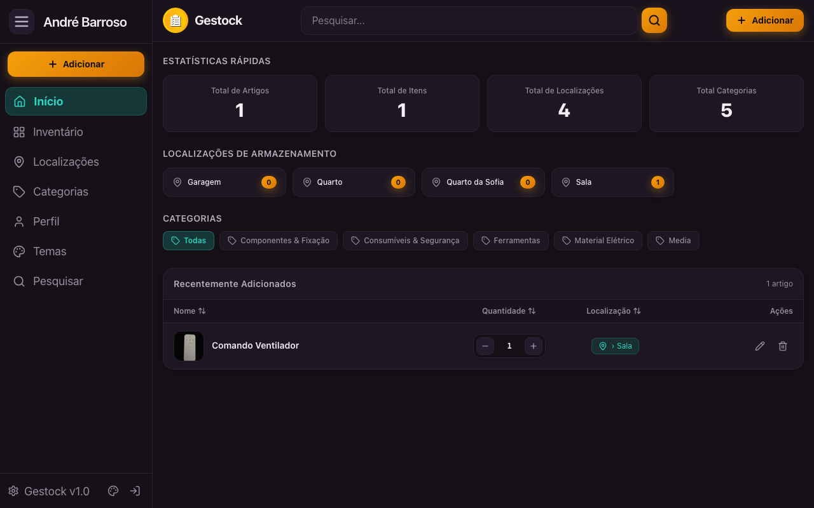
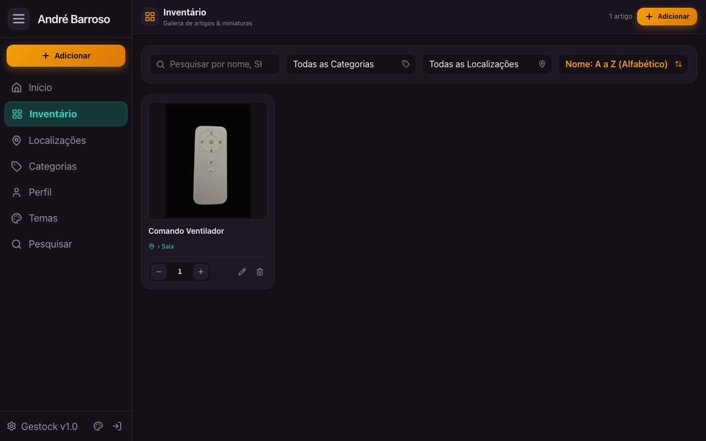
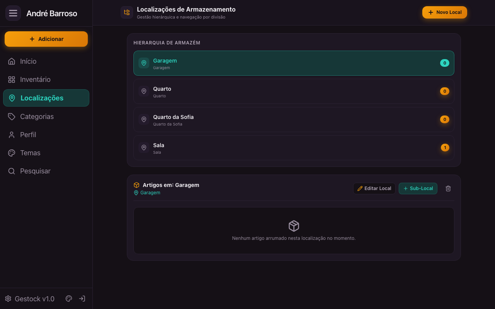
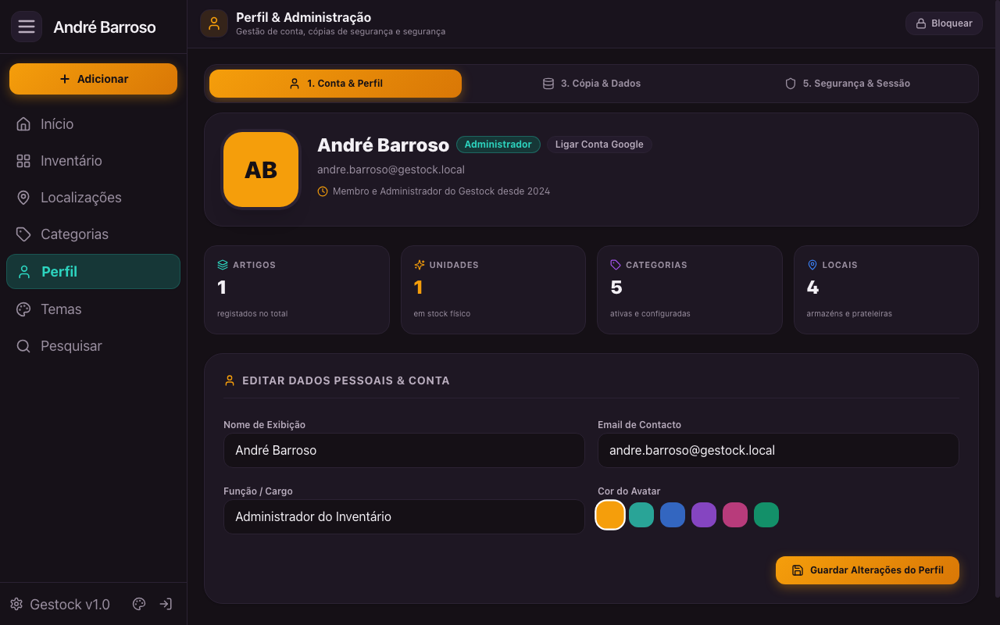

<div align="center">

# 📦 Gestock

### Sistema Moderno de Gestão de Inventário e Armazenamento Doméstico / PME

[](https://github.com/Barroso88/gestock/actions/workflows/docker-publish.yml)
[](https://github.com/Barroso88/gestock/pkgs/container/gestock)
[-000000?logo=next.js&logoColor=white)](https://nextjs.org/)
[](https://react.dev/)
[](https://www.typescriptlang.org/)
[](https://tailwindcss.com/)
[](https://www.prisma.io/)

<p align="center">
  Uma aplicação web e PWA rápida, bonita e intuitiva inspirada no design HomeBox, desenvolvida para organizar caixas, ferramentas, material eletrónico e itens domésticos com fotografias reais, navegação por divisão e sincronização instantânea.
</p>

[✨ Funcionalidades](#-funcionalidades) •
[📸 Previews](#-previews) •
[🐳 Instalação no Unraid / Docker](#-instalação-no-unraid--docker) •
[💻 Desenvolvimento](#-desenvolvimento-local) •
[🗺️ Estrutura](#️-estrutura-do-projeto)

---

</div>

## 📸 Previews

### 🖥️ Dashboard Principal (Início)
> Visão panorâmica com métricas em tempo real, atalhos para locais de arrumação, filtro dinâmico por categoria e tabela de artigos recentes com controlo rápido de stock.



---

### 📦 Galeria de Inventário & Pesquisa
> Vista em grelha com miniaturas em alta definição, ordenação alfabética e filtragem combinada por divisão e etiqueta.



---

### 📍 Hierarquia de Locais de Armazenamento
> Gestão em árvore por divisões (Garagem, Escritório, Sala, Caixas e Prateleiras) com contadores automáticos de itens guardados em cada localização.



---

### 👤 Painel de Perfil & Segurança
> Gestão de utilizador administrador, personalização de nome e cor de avatar, e autenticação OAuth 2.0 com Conta Google.



---

## ✨ Funcionalidades

- **🖼️ Miniaturas & Compressão Inteligente**:
  - Upload direto pela câmara ou galeria do telemóvel.
  - Conversão e compressão automática no browser em formato leve **WebP** antes do envio.
- **⚡ Ajustes Rápidos com 1 Clique**:
  - Botões `+` e `-` inline para atualizar a contagem de stock sem precisar de abrir modais.
- **📍 Localizações Hierárquicas**:
  - Organize em profundidade: *Armazém / Divisão > Estante > Prateleira > Caixa*.
  - Navegação visual fluida e contagem agregada de peças.
- **🏷️ Categorias & Taxonomia**:
  - Cores e ícones personalizados para ferramentas, consumíveis, material elétrico, media, etc.
- **🔒 Autenticação Google & Sessões**:
  - Login seguro com OAuth 2.0 Google ou modo demonstrativo / local.
- **🎨 Sistema de Temas**:
  - Temas otimizados com suporte dark mode de alto contraste (HomeBox Dark Amber, Emerald, Cyberpunk, etc.).
- **📱 PWA (Progressive Web App)**:
  - Instalável como app nativa no iPhone (iOS) e Android através de `Adicionar ao ecrã principal`.
- **🐳 Multi-Stage Docker Standalone**:
  - Imagem ultraleve baseada em `node:20-alpine` com inicialização automática do esquema SQLite.

---

## 🐳 Instalação no Unraid / Docker

A imagem Docker é compilada e publicada automaticamente para o **GitHub Container Registry**:

```bash
docker pull ghcr.io/barroso88/gestock:latest
```

### 1. No Unraid (Interface Gráfica)
Consulte o guia completo em [UNRAID.md](UNRAID.md).

* **Repository**: `ghcr.io/barroso88/gestock:latest`
* **Porta Web (Host:Container)**: `3000:3000`
* **Volume Persistente (Host:Container)**:
  * Caminho do Host: `/mnt/user/appdata/gestock`
  * Caminho do Container: `/app/data`
* *(Opcional)* Variáveis de Ambiente para Google Login:
  * `GOOGLE_CLIENT_ID`
  * `GOOGLE_CLIENT_SECRET`
  * `NEXT_PUBLIC_APP_URL` (ex: `http://192.168.1.100:3000`)

> [!TIP]
> Todos os ficheiros da base de dados (`gestock.db`) e as fotografias carregadas (`uploads/`) são guardados na pasta persistente `/mnt/user/appdata/gestock`, garantindo que atualizar a imagem do container **nunca** apaga os seus dados!

---

### 2. Docker Compose

Pode também iniciar o Gestock com `docker compose`:

```yaml
services:
  gestock:
    image: ghcr.io/barroso88/gestock:latest
    container_name: gestock
    restart: unless-stopped
    ports:
      - "3000:3000"
    environment:
      - NODE_ENV=production
      - DATABASE_URL=file:/app/data/gestock.db
      - NEXT_PUBLIC_APP_URL=http://localhost:3000
      # Opcional (Google OAuth):
      # - GOOGLE_CLIENT_ID=
      # - GOOGLE_CLIENT_SECRET=
    volumes:
      - ./data:/app/data
```

Execute:
```bash
docker compose up -d
```

---

## 💻 Desenvolvimento Local

Caso queira executar e modificar o código fonte no seu computador:

### Pré-requisitos
* Node.js 20+
* npm ou pnpm

### Passos:
```bash
# 1. Clonar o repositório
git clone https://github.com/Barroso88/gestock.git
cd gestock

# 2. Instalar dependências
npm install

# 3. Configurar variáveis de ambiente
cp .env.example .env

# 4. Inicializar base de dados SQLite
npm run db:push

# 5. Iniciar servidor de desenvolvimento
npm run dev
```

Abra [http://localhost:3000](http://localhost:3000) no seu navegador.

---

## 🗺️ Estrutura do Projeto

```text
├── docs/
│   └── screenshots/            # Capturas de ecrã para documentação
├── prisma/
│   ├── schema.prisma           # Esquema da base de dados SQLite
│   └── seed.js                 # Dados de exemplo para inicialização
├── public/                     # Ficheiros estáticos, ícones e PWA Manifest
├── src/
│   ├── actions/                # Next.js Server Actions (CRUD inventário)
│   ├── app/                    # Next.js 15 App Router (Páginas e APIs)
│   │   ├── api/                # Endpoints (Upload, Auth Google, Search)
│   │   ├── inventory/          # Galeria de miniaturas
│   │   ├── locations/          # Hierarquia de locais
│   │   ├── manage/             # Gestão de categorias
│   │   └── profile/            # Perfil & Administração
│   ├── components/             # Componentes React reutilizáveis
│   └── lib/                    # Utilitários (Prisma, Auth, Compressão de imagem)
├── Dockerfile                  # Multi-stage Docker build
├── docker-entrypoint.sh        # Script de inicialização do container
├── docker-compose.yml          # Stack Docker Compose de referência
└── UNRAID.md                   # Manual de configuração detalhado para o Unraid
```

---

## 📄 Licença

Este projeto é disponibilizado para uso pessoal e comunitário. Sinta-se à vontade para utilizar, sugerir melhorias ou contribuir com pull requests!
